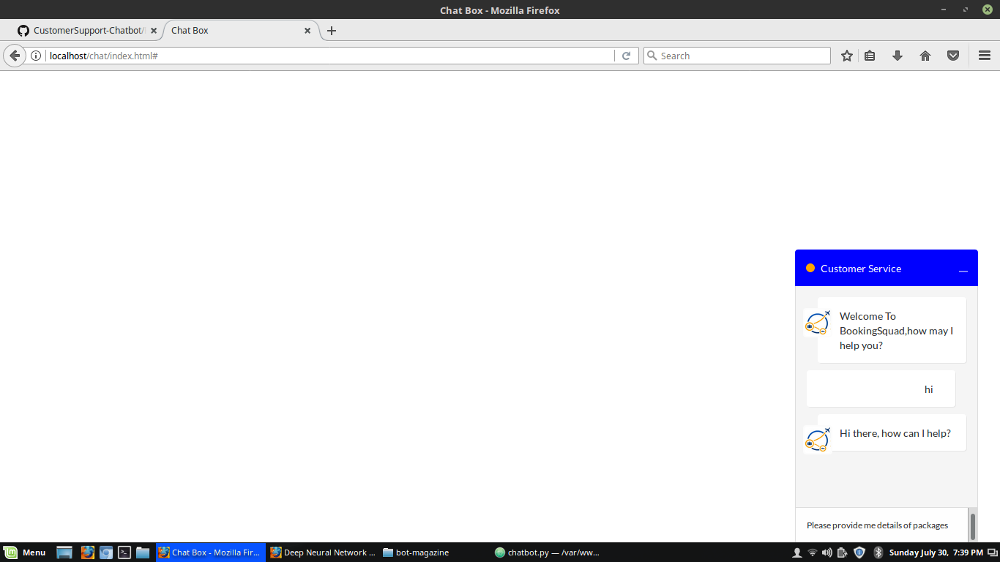
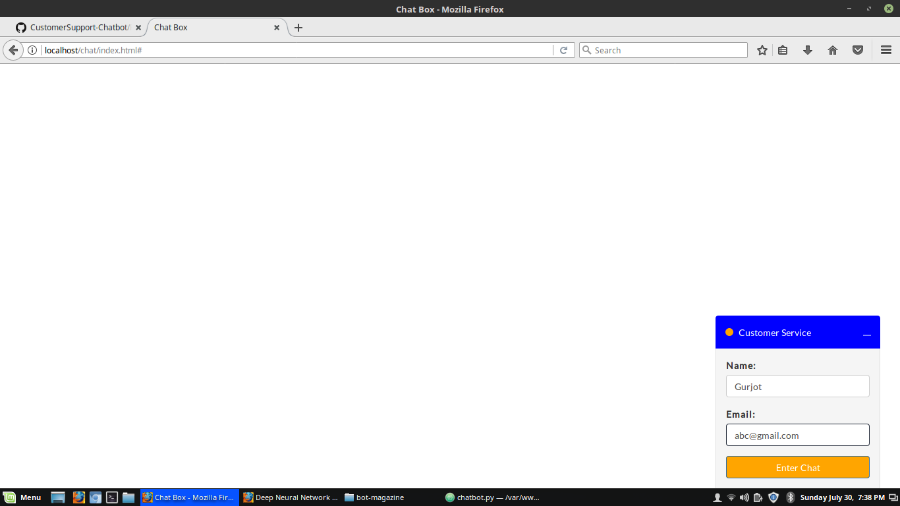

# CustomerSupport-Chatbot
The above provided files only have chatbot python code.The Web content is not provided. 
To use it,firstly you have to configure all paths according to your system. 
Steps: 
1.Install all required libraries on system(tflearn,keras,tensorflow,etc) mentioned in code. 
2.Install nltk data and provide path accordingly. 
3.Run initialize.py,then train.py and then chatbot.py 
4.Test some inputs.

  
  

